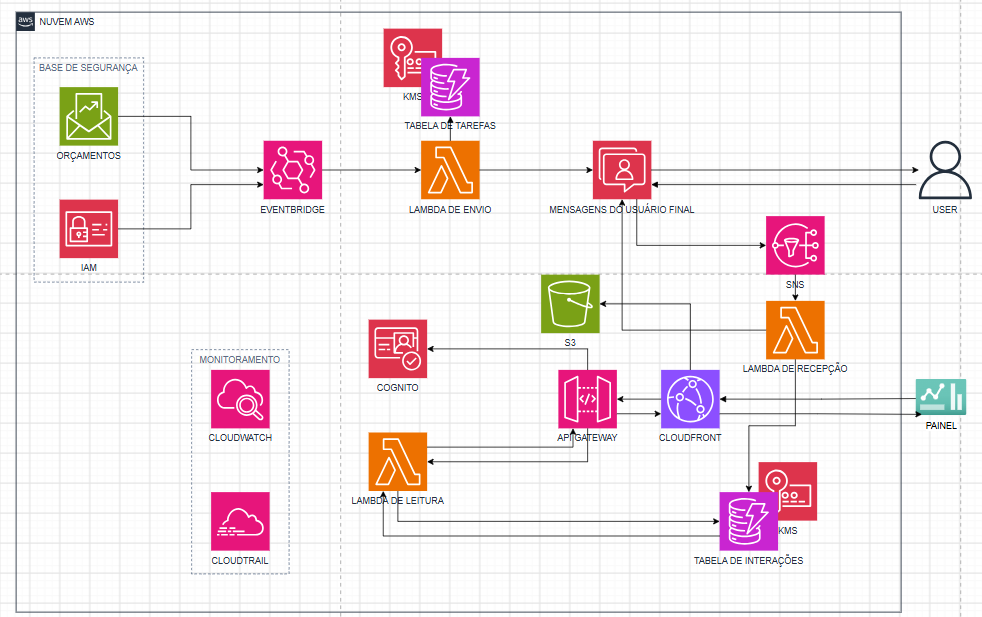

# WhatsApp-Task-Notifier-AWS
Automação de notificações de tarefas via WhatsApp Business API e AWS, com dashboard web para acompanhamento em tempo real.

<video src="https://github.com/user-attachments/assets/02820e8e-8330-40ce-9b58-8bdb2a5f834f" controls></video>

---

## 📋 Sobre o projeto

Em horários programados, o sistema envia uma mensagem via WhatsApp avisando
o funcionário sobre uma tarefa. A resposta (**Está feito** / **Ainda não
fiz** / **Preciso de ajuda**) é processada automaticamente e refletida em
tempo real num dashboard, permitindo acompanhar toda a equipe de usuários/funcionários.

O projeto nasceu de uma necessidade real no meu trabalho em TI de um
mercado, e foi reconstruído aqui como estudo aprofundado de arquitetura
serverless, também servindo de apoio para minha certificação **AWS
CLF-C02**.

A arquitetura é genérica o suficiente para outros casos de notificação e
confirmação via WhatsApp, como lembretes de medicação, check-ins de saúde,
onboarding de funcionários, ou qualquer fluxo que precise de um lembrete
programado com resposta rastreável, bastando adaptar o conteúdo das
mensagens e os dados armazenados.

**Stack:** AWS Lambda · DynamoDB · EventBridge Scheduler · End User
Messaging Social · SNS · API Gateway · S3 · CloudFront · Cognito · KMS ·
IAM · CloudTrail · CloudWatch · Budgets

Python · HTML

---

## 🔎 Decisões técnicas de destaque

- **CORS RESOLVIDO ARQUITETURALMENTE:**, colocando S3 e API Gateway atrás
  do mesmo domínio do CloudFront, não via configuração de headers.
- **BUG DE TIMEOUT MASCARADO POR PROTEÇÃO CONTRA DUPLICIDADE:** um timeout
  de 3s não ajustado fazia o SNS reenviar a execução, mas como o `status`
  já tinha sido atualizado na 1ª tentativa, a 2ª saía sem enviar resposta
  ao usuário, só identificado analisando os logs do CloudWatch em
  detalhe.
- **ESTRATÉGIA DE ISG COM PARTIÇÃO FIXA:** para evitar `scan` caro, já que
  ISGs não aceitam condição de intervalo na partition key.

📄 [Documentação técnica completa](docs/DOCUMENTACAO.md) — passo a passo
de cada serviço, segurança, solução de problemas e glossário.

---

## 💰 Custo estimado

**≈ $65/mês** para 15 usuários — dos quais **90% é o canal do WhatsApp**,
não a infraestrutura AWS (que fica quase toda dentro do Free Tier).
Tabela completa e link do Pricing Calculator na
[documentação](docs/DOCUMENTACAO.md#estimativa-de-custos).

---

## 🔗 Links úteis

- 📄 [Documentação técnica completa](docs/DOCUMENTACAO.md)
- 🐍 [Lambda de envio](lambdas/envio_notificacao_tarefa.py) · [Lambda de recepção](lambdas/recepcao_resposta_whatsapp.py) · [Lambda de leitura](lambdas/leitura_dashboard.py)
- 🌐 [Dashboard (index.html)](dashboard/index.html)

---

## 📜 Licença

MIT, veja [LICENSE](LICENSE).
