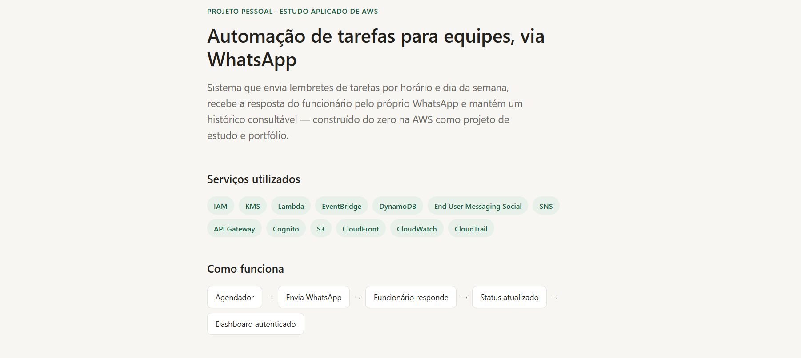
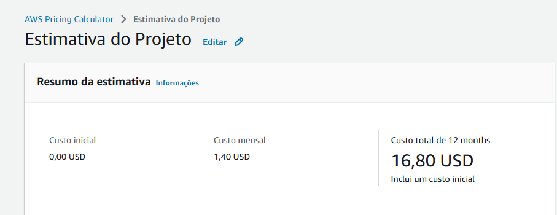

**DOCUMENTAÇÃO PROJETO**

Automação de Tarefas via WhatsApp

**Projeto:** Sistema de notificação de tarefas para funcionários em seus
devidos horários de realização dessas tarefas via WhatsApp e com um
dashboard de acompanhamentos, foi implementado no console Amazon Web
Services (AWS) na região América do Sul (São Paulo) - **sa-east-1.**

# Sumário

- Visão Geral
- Serviços Utilizados
- Diagrama da Infraestrutura
- Fluxo de Dados Completo
- Implementação
- IAM
- AWS Budgets
- AWS End User Messaging
- AWS KMS
- Amazon DynamoDB
- AWS Lambda
- Amazon SNS
- Amazon EventBridge (Scheduler)
- Amazon Cognito
- Amazon API Gateway
- Amazon S3
- Amazon CloudFront
- Amazon Cognito - URLs finais
- CloudWatch e CloudTrail
- Segurança de Dados
- Estimativa de Custos
- Checklist de Validação
- Solução de Problemas
- Glossário de Conceitos
- Notas para Migrações Futuras

# Visão Geral

### O QUE O SISTEMA FAZ?

Em horários programados, o sistema envia uma mensagem via WhatsApp
para o número cadastrado no banco de dados avisando sobre uma tarefa.
A pessoa responde com um botão (“Está feito.”,“Não está feito.” ou
“Preciso de ajuda.”). O sistema reage automaticamente de acordo com a
escolha: se for “Está feito.”, informa a próxima tarefa do dia; se for
“Não está feito.”, apenas registra o status; se for “Preciso de
ajuda”, diz para aguardar até que alguém possa ajudar. Todas as
interações ficam disponíveis num dashboard web autenticado, que pode
ser filtrado pelo ID da pessoa.

### O QUE E QUEM ELE AJUDA?

O sistema foi pensado para pessoas que precisam de lembretes
automáticos para realizar certas tarefas durante o dia e também para
empresas que pretendem colocar uma agenda de tarefas automatizadas
para os seus funcionários. O sistema oferece baixo custo, cobrando
apenas pelo uso. A infraestrutura utilizada é serverless, o que
significa que você pode criar e executar as aplicações sem precisar
administrar servidores.

### PRÉ REQUISITOS DA INFRAESTRUTURA

- Conta AWS (recomendado um e-mail dedicado, separado do pessoal).

- Cartão de crédito cadastrado (por conta de alguns serviços serem pagos e é exigido mesmo em contas no Free Plan).

- Um número de telefone "limpo" (sem WhatsApp pessoal ativo) para ser o número business.

- Conta Meta Business Manager (pode ser criada durante o processo).

- Acesso a um celular de teste para simular o funcionário.

# Serviços Utilizados

| **CATEGORIA**              | **SERVIÇOS**                                     |
|----------------------------|--------------------------------------------------|
| Segurança e acesso         | IAM, AWS KMS, Amazon Cognito                     |
| Processamento              | AWS Lambda, Amazon EventBridge (Scheduler)       |
| Dados                      | Amazon DynamoDB                                  |
| Mensageria                 | AWS End User Messaging, Amazon SNS               |
| Interface web              | Amazon API Gateway, Amazon S3, Amazon CloudFront |
| Monitoramento e governança | Amazon CloudWatch, AWS CloudTrail, AWS Budgets   |

**IAM -** Base de identificação para controle dentro da infraestrutura,
implementação de regras de quem controla e o que controla.

**AWS KMS -** Chave para criptografia e descriptografia de dados dentro
Amazon DynamoDB, só deixa ver os dados quem é autorizado pela própria
configuração do serviço.

**Amazon Cognito -** Serviço que cria uma tela de login na frente do
dashboard para restringir acesso por e-mail e senha (ou outras formas de
acessar) decididos nas configurações feitas pelo próprio sistema

**AWS Lambda -** Serviço serverless que transforma os dados parados na
infraestrutura em eventos de modo geral, na qual precisa ser invocada
por um gatilho (Amazon EventBridge, Amazon SNS, API Gateway), usando
pequenas funções, cada uma com seu objetivo, coordenadas através de
códigos em python.

**Amazon EventBridge (Scheduler) -** Invoca uma função Lambda durante
espaços de tempo decididos na configuração, ele “acorda” a Lambda para
verificar se há alguma tarefa naquele determinado horário.

**Amazon DynamoDB -** Um banco de dados com tabelas de tarefas e de
interação do usuário no WhatsApp que serão resgatadas e retornadas por
uma função Lambda, essa mesma tabela de interações também é consultada,
de forma independente, por uma outra Lambda sempre que o dashboard pede
os dados de alguém.

**AWS End User Messaging -** Envia através de templates de mensagem
feitos pelo usuário, uma mensagem no número de WhatsApp com as
informações determinadas, é necessário aprovação do template de mensagem
pela Meta.

**Amazon SNS -** É o serviço que funciona como um mensageiro, que recebe
uma informação de que alguém respondeu a mensagem e publica essa
mensagem em um tópico na qual a Lambda está configurada para decidir o
que fazer com ela.

**Amazon API Gateway -** É o intermediário de comunicação entre a
internet e uma Lambda, a internet faz um pedido em HTTP para o serviço e
esse serviço contata a Lambda, que devolve o resultado no qual o API
Gateway transforma em HTTP novamente para se comunicar com a internet.

**Amazon S3 -** Um serviço que armazena/hospeda para o Amazon CloudFront
buscar o site estático HTML em um bucket.

**Amazon CloudFront -** Usado para oferecer HTTPS ao Amazon Cognito (Já
que o Amazon S3 não oferece) e eliminar o CORS, fazendo o navegador
tratar o Amazon S3 e o Amazon API Gateway como uma única origem, já que
estão sobre o mesmo domínio.

**Amazon CloudWatch -** Serviço de monitoramento usado para verificar se
houve comunicação entre as Lambdas e os serviços e vice-versa, também
usado para acompanhamentos de logs para melhorias na infraestrutura.

**AWS CloudTrail -** Registra ações quem fez o que na infraestrutura.

**AWS Budgets -** Um serviço de monitoramento de gastos, configurado
para emitir um alerta no e-mail sempre que exceder um limite que o
próprio administrador pode configurar.

# Diagrama da Infraestrutura

# Fluxo de Dados Completo

1.  O EventBridge invoca a Lambda de envio a cada 5 minutos.

2.  A Lambda de envio consulta a tabela de tarefas e procura se tem alguma tarefa no dia e hora atual.

3.  Se sim, a Lambda de envio comunica o End User Messaging para enviar a mensagem para o usuário.

4.  O End User Messaging envia a mensagem ao usuário.

5.  O usuário responde clicando em um dos botões.

6.  O SNS capta que chegou alguma informação e repassa para a Lambda de recepção.

7.  A Lambda de recepção atualiza o status da tarefa na tabela de interações ou comunica o End User Messaging para enviar outra mensagem, dependendo da configuração.

8.  Quando alguém acessa o dashboard, ele solicita os dados das tarefas.

9.  O CloudFront direciona para o S3 que guarda o HTML do site e também para o API gateway para buscar os dados.

10. O API Gateway recebe o pedido do navegador e confirma com o Cognito se os dados estão todos certos.

11. Se sim, ele invoca a Lambda de leitura para resgatar os dados da tabela de interações.

12. O API Gateway resgata os dados da Lambda de leitura, e após isso entrega os dados para o navegador.

13. O CloudFront repassa os dados no site com segurança, que em seguida aparece para quem consulta o dashboard em questão de segundos.

# Implementação

Nessa parte começaremos a implementação prática da infraestrutura,
seguiremos uma ordem de configurações de serviço de acordo com a forma
mais rápida e prática de aplicar. Lembrando que os nomes de detalhes de
configurações em funções, usuários, tabelas e outros serviços são
completamente opcionais e você poderá colocá-los do jeito que for melhor
para o administrador.

##  **6.1 IAM:**

Após a criação da conta root, configurando um autenticador MFA para essa
mesma conta, começaremos a configuração de permissão e segurança
implementada na conta em que vamos realizar a implementação da
infraestrutura.

- Entrar no serviço IAM.

- Grupos de usuários do IAM > Criar grupo.

- Nome do grupo de usuários: Administradores > Associar políticas de permissões: AdministratorAccess (faz com que todos os usuários desse grupo obtenham acesso administrativo para excluir e adicionar serviços e configurações).

- Usuários do IAM > Criar usuário.

- Nome do usuário: AdministradorProjeto > marque a caixa “Fornecer acesso para os usuários ao Console de Gerenciamento da AWS”.

- Senha personalizada: escolha uma senha.

- Adicione o usuário ao grupo Administradores.

- Revisar e recriar de acordo com o número de usuários que pretende usar (é recomendável anotar o link de acesso desse usuário, login e senha, pois serão usados sempre que acessar o projeto).

- Criar um MFA para esse usuário (é um passo opcional, mas é recomendável para dar uma segurança a mais para o seu projeto).

- Usuários do IAM > AdministradorProjeto > Credenciais de segurança > Atribuir dispositivo com MFA.

- Nome do dispositivo: escolha um nome > escolha um meio de autenticar.

Pronto, a conta foi criada com o MFA configurado, terminamos o primeiro
passo do IAM.

##  **6.2 AWS Budgets:**

Essa configuração ainda se faz na conta root, é um serviço opcional mas
muito útil para controle de gastos e alertas de excesso de cobrança.

- Gerenciamento de faturamento e custos > Orçamentos > Criar um orçamento.

***As configurações dos Budgets que serão mostradas são o suficiente
para o meu projeto, porém em outros casos com implementação empresarial,
irá depender de como você quer implementar o seu projeto, se terão
muitas notificações, se tem um orçamento mais alto, isso é de sua
escolha.***

- Em Configuração do orçamento marque Usar um modelo (simplificado).

- Em Modelos marque Orçamento de custo mensal.

- Nome do orçamento: Budgets do projeto > Insira o valor orçado (US$): 5.00.

- Destinatários de e-mail: seu e-mail root > Criar orçamento.

Budget configurado, você pode configurar seus alertas manualmente,
quando receber as notificações nos e-mails e a porcentagem para começar
a receber.

## **6.3 AWS End User Messaging:**

Mesmo o serviço sendo principalmente usado pelo template, optei por
colocar ele primeiro nas configurações, pois é o que leva maior tempo
para a aprovação da Meta e pela compra de um chip de celular para o
Whatsapp Business.

- Entre no End User Messaging > Escolha Whatsapp > Gerenciar mensagens sociais.

- Ads Whatsapp Business Account > Iniciar portal do Facebook (é necessario para vincular sua conta Meta com a AWS).

**NOTA IMPORTANTE:** Quando o usuário estiver configurando sua conta
Business com a Meta, eles irão pedir um site em HTTPS da sua empresa,
porém se o usuário estiver realizando a infraestrutura para fins
pessoais ele não terá esse site estático, entretanto há uma maneira de
conseguir esse HTTPS usando uma implementação que usaremos só mais pra
frente nesse projeto, que é hospedar um site estático no Amazon S3 e
gerar a URL deste site no Amazon CloudFront, para enfim colocar o site
no vínculo com a Meta, segue o passo a passo para realizar a
configuração:

—------------------------------------------------------------------------------------------------------------------------

***Esses passos não são obrigatórios para quem vai usar
profissionalmente em uma empresa que tenha um site estático. Nesses
casos, só pule as instruções para depois da linha***

- Entre no S3 > Criar bucket > Região: São Paulo (sa-east-1) > Nome do bucket: (tem que ser um nome único de sua escolha) > desmarque a opção Bloquear todo o acesso público.

- Peça para alguma IA criar um HTML básico sobre o projeto, já que a idéia não é perder muito nessa parte. Assim ficou o meu site:

- Clique no seu bucket > Propriedades > Hospedagem de site estático > Hospedagem de site estático clique em Ativar > Documento de índice: sobre.html (o nome do site que a IA criou em HTML) > Salvar alterações.

- Permissões > Política do bucket > Editar > Política: (cole esse código)

{

"Version": "2012-10-17",

"Statement": [

{

"Sid": "PublicReadGetObject",

"Effect": "Allow",

"Principal": "*",

"Action": "s3:GetObject",

"Resource": "arn:aws:s3:::NOME DO SEU BUCKET/*"

}

]

}

- Salvar alterações.

- Objetos > Carregar > Adicionar arquivos: (escolha o arquivo HTML que foi criado) > Carregar.

- Propriedades > Hospedagem de site estático > copia a URL.

- Abra CloudFront > Criar distribuição > Plano free > Próximo.

- Nome da distribuição: (qualquer nome de sua preferência) > Próximo.

- Origem S3: cola a URL > Configurações de origem clique em Personalizar configurações de origem > Protocol: Only HTTP > Configurações de cache clique em Personalizar as configurações de cache > Política de protocolo do visualizador escolha Redirecionar HTTP para HTTPS > Métodos HTTP permitidos escolha GET, HEAD > Próximo > Próximo > Criar distribuição.

- Espera o status ficar Deployed > Nome de domínio de distribuição copie a URL > testar no navegador.

- Após isso, copia a URL do seu site > cole a URL na parte da configuração da Meta em que pede o site estático > siga com as configurações.

—------------------------------------------------------------------------------------------------------------------------

- Na nova página, escreva o código que recebeu anteriormente > Publicação de mensagens e eventos deixe desabilitada por enquanto (será habilitada quando fizer o SNS).

- Message templates > Create template.

- Business account: Projeto AWS (sua conta Business da Meta) > Template name: notificacao_tarefa > Template language: Portuguese (BR) > Message type marque Utility.

- Variable type: Number > Header type: Text > Header text: NOTIFICAÇÃO DE TAREFA > Body: Oi (clique em Add variable) ! Passando para avisar que chegou a hora de (clique em Add variable). Assim que concluir, toque em um dos botões abaixo para confirmar.

- Valor da {{1}}: Eduardo (nome do usuário/funcionário) > Valor da {{2}}: Abrir o computador (tarefa).

- Add button > Button type: Quick reply > Button text: Está feito.

- Add button > Button type: Quick reply > Button text: Ainda não fiz.

- Add button > Button type: Quick reply > Button text: Preciso de ajuda > Submit for approval (o tempo de aprovação de um template é de 1 á 2 dias, por isso fazer esse serviço primeiro é eficaz).

***Nesse processo você precisará de um chip de celular novo, ou um que
nunca foi usado pelo Whatsapp, mesmo que só tenha sido usado no pessoal.
Quando concluir o vinculação da conta Meta é importante que você não
coloque esse número dentro do aplicativo Whatsapp Business, ele pode dar
conflito e acabar não funcionando, se você por algum acaso colocou o
número no aplicativo, é só tirar esse número da conta do Whatsapp que
ele já deve voltar a funcionar***

## **6.4 AWS KMS:**

O serviço vai ser configurado na conta de administrador que você criou
anteriormente (não se esqueça de mudar a região do seu projeto para
América do Sul (São Paulo)).

- Entre no serviço Key Management Service > Criar uma chave.

- Tipo de chave marque Simétrica > Uso da chave marque Criptografar e descriptografar > Próximo.

- Alias: criptografia-funcionarios > Próximo.

- Administradores de chaves: AdministradorProjeto > Próximo.

- Usuários de chaves: AdministradorProjeto e as roles de Lambda que vão ler/escrever nas tabelas (as roles serão criadas em passos mais à frente da implementação, quando forem criadas voltaremos a este serviço para autorizar elas a usarem a chave) > Próximo > Criar a chave.

Com a chave criada temos mais segurança tanto da infraestrutura quanto
dos dados sensíveis de usuários, essa criptografia é importante pois
somente quem é autorizado á utilizar a chave pode ver os dados que estão
configurados, pessoas não autorizadas não têm acesso.

## **6.5 Amazon DynamoDB:**

### TABELA 1 - TAREFAS

- Entre no DynamoDB > Criar tabela.

- Nome da tabela: Tabela-de-Tarefas > Chave de partição: ID (String) > Chave de Classificação: tarefa_chave (String).

***A chave de partição e de classificação são essenciais para o
projeto, a chave de partição define onde vamos começar a procurar a
informação (no caso o ID) e a chave de classificação será o que vai
diferenciar um item de outro***

- Em Configurações da tabela marque Personalizar configurações > Configurações da capacidade de leitura/gravação marque Sob demanda.

- Índices secundários > Criar índice global.

- Nome do índice: indice-por-horario > Chave de partição: isg_particao (String) > Chave de classificação: hora_tarefa (String) > Criar índice.

***O índice secundário também é imprescindível para o projeto pois traz
outra maneira de organizar a consulta dos dados na nossa tabela, fazendo
com que além de procurar pelo ID, também procure pelo horário ou pelo
número de telefone, sendo muito mais eficiente do que só ter uma chave
de partição e classificação***

- Criptografia em repouso marque Chave gerenciada pelo cliente: criptografia-funcionarios > Criar tabela.

- Explorar itens > Tabela-de-Tarefas > Criar item.

- ID: 01 > tarefa_chave: 08:00#Ligar o computador (horario da tarefa # tarefa).

- Adicionar novo atributo > String > hora_tarefa: 08:00 (horario da tarefa).

- Adicionar novo atributo > String > tarefa: Ligar o computador (tarefa).

- Adicionar novo atributo > String > nome: Eduardo (nome do usuário/funcionário).

- Adicionar novo atributo > String > numero_whatsapp: +55…(número de whatsapp do usuário/funcionário).

***O número deve começar com por +55 (ou o DDI do seu país), não deve
ter nenhum outro caractere e deverá ser colocado todos os números
juntos, exemplo: +5511999999999***

- Adicionar novo atributo > String > isg_particao: TAREFA (junta todos os itens num campo nomeado como TAREFA, assim facilitando a consulta por parte da Lambda).

- Adicionar novo atributo > Conjunto de strings > dias_semana > insira um campo (adicionar a quantidade de campos na mesma quantidade de dias da semana que você deseja que o usuário receba essa tarefa nesse horário em específico).

| VALOR 0 | SEG |
|---------|-----|
| VALOR 1 | TER |
| VALOR 2 | QUA |
| VALOR 3 | QUI |
| VALOR 4 | SEX |

- Criar item (criar a quantidade de itens que quiser, tem que ter as mesmas colunas e valores, porém com tarefas e horários podendo ser variados).

### TABELA 2 - INTERAÇÕES

- Criar tabela > Nome da tabela: Tabela-de-Interacoes > Chave de partição: ID (String) > Chave de classificação: tarefa_data (String).

- Em Configurações da tabela marque Personalizar configurações > Configurações da capacidade de leitura/gravação marque Sob demanda.

- Índices secundários > Criar índice global.

- Nome do índice: indice-por-numero > Chave de partição: numero_whatsapp (String) > Chave de classificação: tarefa_data (String) > Criar índice.

- Criptografia em repouso marque Chave gerenciada pelo cliente: criptografia-funcionarios > Criar tabela.

***Na tabela de interações, nós não criamos nenhum item manualmente,
ela vai ser preenchida pelas Lambdas de envio e recepção***

## **6.6 AWS Lambda:**

***Para os códigos das Lambdas rodarem, é necessário o ID de alguns
serviços como o AWS End User Messaging e Amazon CloudFront. Aqui está o
passo a passo de como conseguir o ID de cada um deles:***

AWS End User Messaging:

- Entre no serviço > Social messaging > Contas comerciais do WhatsApp > Clique na sua conta comercial > Números de telefone > Copie o ID do número de telefone > Substitua nos códigos pelo ID copiado.

Amazon CloudFront:

- Entre no serviço > Sua distribuição > Copie a URL de Distribution domain name > Cole no código da Lambda.

### LAMBDA 1 - ENVIO

- Entrar na Lambda > Criar uma função > Criar do zero.

- Nome da função: envio_notificacao_tarefa > Tempo de execução: Python > Criar função.

#### Código Python da função:

Código completo em [`lambdas/envio_notificacao_tarefa.py`](../lambdas/envio_notificacao_tarefa.py).

- Configuração > Configuração geral > Editar > Tempo limite: 0 min 15 seg > Salvar.

- Configuração > Permissões > em Nome do perfil clique no link.

- Políticas > Criar política > Editor de políticas: JSON > Cole este código:

{

"Version": "2012-10-17",

"Statement": [

{

"Effect": "Allow",

"Action": [

"social-messaging:SendWhatsAppMessage",

"social-messaging:GetWhatsAppMessageMedia",

"social-messaging:ListLinkedWhatsAppBusinessAccounts",

"social-messaging:GetLinkedWhatsAppBusinessAccount",

"social-messaging:GetLinkedWhatsAppBusinessAccountPhoneNumber"

],

"Resource": "*"

}

]

}

***É necessário criar essa política pois não existia uma política
pronta que dá permissão ao AWS End User Messaging enviar uma mensagem no
WhatsApp, e a Lambda precisa provar que tem autorização para pedir o
envio da mensagem***

- Nome da política: PermissaoEnvioWhatsApp > Criar política.

- Funções > Clique na função: envio_notificacao_tarefa-role-xxxxxx.

- Permissões > Em Políticas de permissões clique em Adicionar permissões > Anexar políticas.

- Pesquise e clique nas políticas: AmazonDynamoDBFullAccess e PermissaoEnvioWhatsApp > Adicionar permissões.

### LAMBDA 2 - RECEPÇÃO

- Entrar na Lambda > Criar uma função > Criar do zero.

- Nome da função: recepcao_resposta_whatsapp > Tempo de execução: Python > Criar função.

#### Código Python da função:

Código completo em [`lambdas/recepcao_resposta_whatsapp.py`](../lambdas/recepcao_resposta_whatsapp.py).

- Configuração > Configuração geral > Editar > Tempo limite: 0 min 10 seg > Salvar.

- Configuração > Permissões > em Nome do perfil clique no link.

- Permissões > Em Políticas de permissões clique em Adicionar permissões > Anexar políticas.

- Pesquise e clique nas políticas: AmazonDynamoDBFullAccess e PermissaoEnvioWhatsApp > Adicionar permissões.

### LAMBDA 3 - LEITURA

- Entrar na Lambda > Criar uma função > Criar do zero.

- Nome da função: leitura_dashboard > Tempo de execução: Python > Criar função.

#### Código Python da função:

Código completo em [`lambdas/leitura_dashboard.py`](../lambdas/leitura_dashboard.py).

- Configuração > Permissões > em Nome do perfil clique no link.

- Permissões > Em Políticas de permissões clique em Adicionar permissões > Anexar políticas.

- Pesquise e clique na política: AmazonDynamoDBFullAccess > Adicionar permissões.

*Após a criação dos Lambdas, colocá-los como usuário da chave do KMS:

- Entre no KMS > Escolha a chave criada > Política de chaves > Usuários de chaves: Adicionar > Adicione as 3 funções Lambda criadas.

## **6.7 Amazon SNS:**

- Entre no SNS > Tópicos > Criar tópico.

- Padrão > Nome: whatsapp-respostas-usuario > Criar tópico > Clicar no seu tópico > Copiar o ARN.

- Entre no AWS End User Messaging > Social messaging > Contas comerciais do WhatsApp > Clique na sua conta comercial.

- Destino do evento > Editar destino > Em Publicação de mensagens e eventos clique em Habilitado > Tipo de destino: Amazon SNS > Topic ARN: a ARN que está copiada.

- Entre na Lambda > Funções > Clique em recepcao_resposta_whatsapp > Adicionar gatilho > Selecionar SNS > Tópico do SNS: whatsapp-respostas-usuario > Adicionar.

## **6.8 Amazon EventBridge:**

***Iremos configurá-lo para que ele “acorde” a Lambda de envio de 5 em
5 minutos para ver se há alguma tarefa a ser feita naquele momento
buscando na tabela do DynamoDB, também ajudará no custo/volume de
invocações ***

- Entre no EventBridge > Programação do EventBridge > Criar programação.

- Nome do cronograma: verificacao-tarefas-minuto > Em Ocorrência clique em Cronograma recorrente > Fuso horário: (UTC-03:00) America/Sao_Paulo > Em Tipo de cronograma escolha Cronograma baseado em intervalos.

- Expressão rate: valor = 5 e unidade = minutes > Janela de tempo flexível: Desligado > Próximo.

- Em API do destino clique em Destinos modelados > Escolha AWS Lambda > Função do Lambda: envio_notificacao_tarefa > Próximo.

- Habilitar cronograma: Habilitar > Ação após a conclusão do agendamento: None > Em Perfil de execução escolha Criar um novo perfil para este cronograma (pode deixar o nome padrão) > Próximo > Criar cronograma.

## **6.9 Amazon Cognito:**

***Nesse serviço configuramos como e quem pode acessar o dashboard,
neste projeto colocaremos apenas e-mail e senha, porém para outras
implementações, o administrador pode utilizar o meio que preferir***

- Entrar no Cognito > Grupos de usuários > Criar grupo de usuários.

- Tipos de aplicação: Aplicação de página única (SPA) > Nome: dashboard > Em Opções para identificação de login marque E-mail > Autorregistro deixe desabilitado > Atributos obrigatórios para a inscrição escolha email.

- Adicionar URL de retorno: https://localhost:8000/ (será apenas uma URL provisória, depois que configurarmos o CloudFront e o S3 substituiremos para o novo domínio) > Criar diretório de usuário.

- Grupos de usuários > Clientes das aplicação > Clique em dashboard > Páginas de login > Em configurações gerenciadas de páginas de login clique em Editar.

- URL de redirecionamento padrão: https://localhost:8000/ > Provedores de identidade: Grupos de usuários do Cognito > Tipo de concessão do OAuth 2.0: Concessão de código de autorização > Escopos de conexão OpenID: E-mail e OpenID > Salvar alterações.

- Usuários > Criar usuário.

***Essa parte da configuração vai depender de quantas pessoas o
administrador quer que acesse o dashboard, deverá adicionar o e-mail de
acesso e uma senha provisória que o usuário irá alterar quando fizer o
primeiro login, como é uma parte mais pessoal do projeto, não irei
mostrar a configuração***

## **6.10 Amazon API Gateway:**

- Entre em API Gateway > Criar uma API > API HTTP: Compilar.

- Nome da API: api-dashboard > Tipo de endereço IP: IPv4 > Em Adicionar integração selecione Lambda > Região: sa-east-1 > Função do Lambda: leitura_dashboard > Versão 2.0 > Avançar.

- Método: GET > Caminho do recurso: /dados > Destino da integração: leitura_dashboard > Avançar.

- Nome do estágio: $default > Ative Implantação automática > Avançar > Criar.

- Authorization > Clique em GET > Criar e anexar um autorizador.

- Tipo de autorizador: JWT > Nome: autorizador-cognito > Origem de identidade: $request.header.Authorization > URL do emissor (precisa digitar manualmente a URL https://cognito-idp.sa-east-1.amazonaws.com/SEU-USER-ID, o jeito de conseguir seu USER ID é entrando no Cognito > Visão geral e copie o que está dentro de ID do grupo de usuários, depois cole no resto dessa URL).

- Público > Adicionar público: (Entra no Cognito > Grupos de usuários > Clique no seu user pool > Clientes da aplicação > Clique em dashboard > Copie ID do cliente > Cole no campo de Público que foi adicionado) > Criar e anexar.

***A configuração do CORS foi tirada dessa aplicação por conta dos
problemas de configuração e autorização que tive na implementação, pois
ele continuava bloqueando a requisição, mesmo em diversos navegadores e
mesmo o curl no prompt de comando conseguindo fazer a chamada de rede
pelo terminal, então optei por eliminar a necessidade do CORS usando
duas rotas do CloudFront, uma para o site no S3 e outra para os dados na
API Gateway***

## **6.11 Amazon S3:**

***Para não perder muito tempo na aplicação, pedi para uma IA criar um
index.html para servir como site dentro do bucket S3, dentro desse
index.html que ele criar haverá algumas linhas que ele não vai conseguir
preencher, pois precisa de dados como a URL do domínio do Cognito, o ID
do cliente e o nome dos usuários que você cadastrou no DynamoDB (o
número de linhas vai variar de acordo com o número de funcionários que o
administrador colocou). Ao acessar o código no GitHub, haverá linhas
escrito: SEU_DOMINIO_COGNITO, SEU_APP_CLIENT_ID e SEU_USUARIO_1/2/3,
aqui está um jeito de acessar todos esse dados para colocar no lugar
certo:***

SEU_DOMINIO_COGNITO:

- Entre no Cognito > Clique no seu user pool > Domínio > Copie a URL do domínio > Cole no código.

SEU_APP_CLIENT_ID:

- Entre no Cognito > Clique no seu user pool > Clientes da aplicação > Clique em dashboard > Copie o ID do cliente > Cole no código.

SEU_USUARIO_1/2/3:

- Entre no DynamoDB > Explorar itens > Tabela-de-Tarefas > Procure pela coluna “nome” da tabela > Crie uma linha no código para cada nome que aparecer > Coloque os nomes nas linhas criadas.

***NOTA:** É de escolha do administrador usar ou não o HTML de site que
foi usado, dependendo da preferência será necessário criar outro site em
HTML para hospedar os dados.

Com o código em HTML atualizado, salve como index.html e voltaremos para
a configuração de como colocar o site estático em um bucket S3.

- Entre no S3 > Buckets de uso geral > Criar bucket.

- Nome do bucket: crie um nome único globalmente para o seu bucket > Desmarque a opção Bloquear todo acesso público > Marque a caixa que aparece logo após desmarcar o bloqueio de acesso > Crie o bucket.

- Propriedades > Hospedagem de site estático: Editar > Ativar > documento do índice: index.html > Salvar alterações.

- Permissões > Política do bucket: Editar > Cole esse código: (coloque o nome do seu bucket no lugar do NOME DO SEU BUCKET)

{

"Version": "2012-10-17",

"Statement": [

{

"Sid": "PublicReadGetObject",

"Effect": "Allow",

"Principal": "*",

"Action": "s3:GetObject",

"Resource": "arn:aws:s3:::NOME DO SEU BUCKET/*"

}

]

}

- Objetos > Carregar > Adicionar arquivos > Adicione o seu index.html > Carregar > Fechar.

## **6.12 Amazon CloudFront:**

- Entre no CloudFront > Criar distribuição > Escolha o plano Livre > Próximo.

- Nome da distribuição: (qualquer nome de sua preferência) > Próximo.

- Tipo de origem: Amazon S3 > Origem S3: (precisa pegar a URL no bucket do S3: Entre no S3 > Buckets de uso geral > Clique no nome do bucket do seu site > Propriedades > Hospedagem de site estático > Endpoint de site de bucket > Copie a URL > Cole na Origem S3).

- Configurações de origem clique em Personalizar configurações de origem > Protocol: Only HTTP > Configurações de cache clique em Personalizar as configurações de cache > Política de protocolo do visualizador escolha Redirecionar HTTP para HTTPS > Métodos HTTP permitidos escolha GET, HEAD > Próximo > Próximo > Criar distribuição.

- Origens > Criar origem > Domínio de origem > Escolha api-dashboard > Protocolo: Somente HTTPS > Criar origem.

- Behaviors > Create behavior > Padrão de caminho: /dados > Origem e grupos de origem: Gateway de API > Métodos HTTP permitidos: GET, HEAD e OPTIONS > Política de chave: Cache desativado > Política de solicitação de origem: AllViewerExceptHostHeader > Criar behavior.

***Para confirmar a validação sem depender do frontend, abra o prompt
de comando e coloque esse código curl -X GET
"https://\<dominio-cloudfront>/dados?id_funcionario=01" -i,
substituindo o \<dominio-coudfront> pelo domínio que aparece na sua
distribuição***

## **6.13 Amazon Cognito - URLs finais:**

Agora vamos atualizar a callback configurada anteriormente para o
cognito.

- Entre no Cognito > Grupos de usuários > Clientes da aplicação > dashboard > Páginas de login > Configuração gerenciada de páginas de login: Editar > URLs de retorno de chamadas permitidos: cole a sua URL de distruibuição > URL de redirecionamento padrão: cole a sua URL de distribuição.

## **6.14 Amazon CloudWatch e CloudTrail:**

**CloudWatch:** não exige criação, os logs de cada Lambda ficam
disponíveis automaticamente. Usado durante testes e diagnóstico de
erros.

- Entre no Lambda > (Função que estiver dando erro) Monitor > Visualizar logs do CloudWatch.

**CloudTrail:** geralmente já ativo por padrão na conta. Usado para
auditoria de ações administrativas e com a KMS Customer Managed Key para
rastrear uso da chave de criptografia.

Esses foram os passos certos para configurar a infraestrutura e fazê-lá
realmente funcionar.

***Durante a documentação, re-fiz o projeto para ter certeza que não
daria errado e enfrentei alguns problemas a mais, todos os problemas
enfrentados foram colocados em Solução de Problemas***

# Segurança de Dados

###  MEDIDAS IMPLEMENTADAS:

- **IAM:** Acesso restrito a usuários com MFA; roles de Lambda com permissão mínima necessária.

- **CRIPTOGRAFIA EM REPOUSO:** Customer Managed Key (KMS) aplicada às duas tabelas do DynamoDB, permitindo auditoria de uso via CloudTrail.

- **CRIPTOGRAFIA EM TRÂNSITO:** TLS em todas as comunicações (DynamoDB, Lambda, API Gateway, CloudFront).

- **AUTENTICAÇÃO DO DASHBOARD:** Cognito com autorregistro desabilitado, só administradores criam contas.

- **BUCKET S3 PÚBLICO LIMITADO:** apenas arquivos estáticos (HTML/JS) são públicos; dados pessoais nunca ficam expostos fora da API autenticada.

### PONTOS DE ATENÇÃO EM CASO DE IMPLEMENTAÇÃO EMPRESARIAL:

- **Definir base legal para tratamento dos dados.**

- **Informar os funcionários sobre a coleta e uso dos dados.**

- **Definir política de retenção e processo de exclusão sob solicitação.**

- **Considerar nomear um responsável interno pelas questões de proteção de dados.**

# Estimativa de Custos

**Premissas:**

15 usuários – 3/5 tarefas ao dia – 2 administradores acessando o
dashboard todo dia.

**Tabela de serviços e seus custos:**

O serviço AWS End User Messaging não está disponível no AWS Pricing
Calculator, o valor total dele é uma estimativa usando a quantidade
estimada de mensagens enviadas e recebidas

### CUSTO AWS (MENSAL/RECORRENTE)

| **SERVIÇO**                                           | **CUSTO ESTIMADO/MÊS (USD)** |
|-------------------------------------------------------|------------------------------|
| AWS Lambda                                            | $0,00                       |
| Amazon DynamoDB                                       | $0,38                       |
| Amazon API Gateway                                    | $0,00                       |
| Amazon SNS                                            | $0,00                       |
| Amazon EventBridge                                    | $0,00                       |
| Amazon S3                                             | $0,00                       |
| Amazon CloudFront                                     | $0,00                       |
| Amazon Cognito                                        | $0,00                       |
| AWS KMS                                               | $1,02                       |
| **Subtotal da Infraestrutura AWS**                    | **$1,40**                   |
| AWS End User Messaging Social (WhatsApp - Meta + AWS) | ~$63,72                     |

### CUSTOS FORA DA AWS

| **ITEM**                                    | **TIPO**            | **CUSTO ESTIMADO**    |
|---------------------------------------------|---------------------|-----------------------|
| Chip para o número WhatsApp Business        | Único (compra)      | R$ 20,00             |
| Manutenção da linha (recarga/plano do chip) | Recorrente (mensal) | R$ 20,00 – R$ 40,00 |

### CUSTOS TOTAL ESTIMADO

|                             | **VALOR MENSAL**                    |
|-----------------------------|-------------------------------------|
| AWS (fatura completa)       | $65,12/mês — R$ 339,79/mês        |
| Manutenção do chip          | R$ 20,00 — RS 40,00                |
| **TOTAL MENSAL RECORRENTE** | **R$ 359,79/mês — R$ 379,79/mês** |
| Custo único inicial (chip)  | RS 20,00 (não recorrente)           |

***Valor estimado de acordo com a cotação atual (Ago/2026), que é de
5,22***

**Orçamento calculado no projeto:**

**Link para acessar a estimativa do projeto:**

[<u>https://calculator.aws/#/estimate?id=02e572daa3fc24c7b16aeee4f7094dea417c6bb1</u>](https://calculator.aws/#/estimate?id=02e572daa3fc24c7b16aeee4f7094dea417c6bb1)

**Observações:**

- 87%-92% do custo total da implementação foi gerado pelo envio e recebimento de mensagem via AWS End User Messaging.

- Alguns serviços pagos (CloudFront, Lambda, DynamoDB, SNS e Cognito) não foram cobrados ou foram pouco cobrados devido ao Free Tier, que pode ser mudado dependendo do tamanho da empresa que é implementado.

- Alguns serviços pagos (API Gateway, EventBridge e S3) não foram cobrados ou foram pouco cobrados devido ao baixo volume usado, o que pode fazer aplicações futuras gerar mais custos sobre esses serviços.

- É recomendável ajustar o valor do alerta do AWS Budgets para refletir no custo real da sua implementação, conforme o número de usuários aumenta o valor do custo do projeto também aumenta.

# Checklist de Validação

| **#** | **TESTE**                                                               | **CONFIRMA**                                                              |
|--------|-------------------------------------------------------------------------|---------------------------------------------------------------------------|
| 1      | curl -X GET no CloudFront sem token = 401                               | Roteamento CloudFront e API Gateway funcionando.                          |
| 2      | curl -X GET com Authorization: Bearer “token” = 200 + dados             | Prova que os dados saem do banco e chegam até o HTTP.                     |
| 3      | CloudWatch mostra execução da Lambda de envio no horário esperado       | Mostra que a Lambda está rodando sozinha.                                 |
| 4      | Mensagem chega no WhatsApp real, depois do template aprovado            | Confirma que existe uma integração completa com a Meta.                   |
| 5      | Clique em "Está feito" gera segunda mensagem                            | O caminho de resposta está completo.                                      |
| 6      | Clique em "Ainda não fiz" atualiza status sem mensagem extra            | A segunda opção de decisão está funcionando.                              |
| 7      | clique em "Preciso de ajuda" atualiza status sem pedir mais informações | A terceira opção de decisão está funcionando.                             |
| 8      | Dashboard exibe interações reais, sem duplicidade                       | Prova que a mensageria e o dashboard compartilham a mesma fonte de dados. |
| 9      | mensagem enviada apenas nos dias da semana configurados                 | Confirma que o filtro está bloqueando corretamente tarefas fora do dia.   |

# Solução de Problemas

### FUSO HORÁRIO E AGENDAMENTO

<table>
<colgroup>
<col style="width: 33%" />
<col style="width: 34%" />
<col style="width: 31%" />
</colgroup>
<thead>
<tr class="header">
<th><strong>SINTOMA</strong></th>
<th><strong>CAUSA RAIZ</strong></th>
<th><strong>CORREÇÃO</strong></th>
</tr>
<tr class="odd">
<th>Lambda calcula horário 3h à frente do esperado</th>
<th>A Lambda roda em UTC por padrão, não no horário de Brasília</th>
<th>
“datetime.now() - timedelta(hours=3)”

logo no início da função
</th>
</tr>
<tr class="header">
<th>Tarefa nunca é encontrada mesmo com horário e dados corretos</th>
<th>Comparação exata de horário (.eq()) nunca coincide com o disparo do
Scheduler, que roda a cada 5 minutos em horários fixos, não no minuto
exato da tarefa</th>
<th>Trocar .eq() por uma janela de tempo, filtrando entre "5 minutos
atrás" e "agora"</th>
</tr>
<tr class="odd">
<th>Mesma tarefa enviada duas vezes, uma janela após a outra</th>
<th>.between() inclui os dois extremos o horário-limite de uma execução
é capturado de novo na execução seguinte</th>
<th>Usar limite inferior exclusivo: .gt() (maior que) combinado com
.lte() (menor ou igual)</th>
</tr>
<tr class="header">
<th>Duplicação reaparece depois de otimizar com índice secundário</th>
<th>Uma KeyConditionExpression de índice não aceita combinar .gt() e
.lte() como duas condições separadas exige um único operador, forçando o
uso de .between() de novo</th>
<th>Deslocar a janela em 1 minuto (minutes=4 em vez de minutes=5),
compensando matematicamente a inclusão dos dois extremos do
.between()</th>
</tr>
</thead>
<tbody>
</tbody>
</table>

### PAYLOAD DO SNS E WHATSAPP

| **SINTOMA**                                                                                   | **CAUSA RAIZ**                                                                                                                                                               | **CORREÇÃO**                                                                                 |
|-----------------------------------------------------------------------------------------------|------------------------------------------------------------------------------------------------------------------------------------------------------------------------------|----------------------------------------------------------------------------------------------|
| Resposta da API confirma sucesso (messageId retornado), mas a mensagem nunca chega no celular | Eventos de teste simulados manualmente não abrem uma janela de conversa real do lado da Meta o envio de texto livre (fora de template) exige uma resposta genuína do cliente | Validar o fluxo de texto livre apenas com interação real, nunca com evento de teste simulado |

### AUTENTICAÇÃO E LOGIN (COGNITO)

| **SINTOMA**                                              | **CAUSA RAIZ**                                                                                                                                          | **CORREÇÃO**                                                                                                                                         |
|----------------------------------------------------------|---------------------------------------------------------------------------------------------------------------------------------------------------------|------------------------------------------------------------------------------------------------------------------------------------------------------|
| redirect_mismatch ao tentar logar                        | A callback URL cadastrada no Cognito não bate exatamente com a URL real usada pelo navegador (diferença de protocolo http/https, porta, ou barra final) | Cadastrar a URL exata, incluindo variantes com e sem barra final; testar sempre em aba anônima, já que o navegador cacheia a página de erro anterior |
| Client is not enabled for OAuth2.0 flows ao tentar logar | Causa não isolada com certeza, configuração parecia correta em todas as verificações                                                                    | Corrigiu a Callback URL via AWS CLI, adicionando variante com/sem barra                                                                              |
| Erro persiste mesmo após corrigir a URL                  | Cache do navegador servindo a tela de erro antiga                                                                                                       | Fechar a aba completamente e reabrir em modo anônimo antes de testar de novo                                                                         |

### HOSPEDAGEM DO DASHBOARD (S3 E CLOUDFRONT)

| **SINTOMA**                                          | **CAUSA RAIZ**                                                                                                                                                                                        | **CORREÇÃO**                                                                                                                        |
|------------------------------------------------------|-------------------------------------------------------------------------------------------------------------------------------------------------------------------------------------------------------|-------------------------------------------------------------------------------------------------------------------------------------|
| 504 Gateway Timeout ao acessar o CloudFront          | A origem foi configurada para conectar via HTTPS, mas o S3 em modo de site estático só responde em HTTP puro                                                                                          | Origin protocol policy para HTTP only                                                                                               |
| Dashboard exibe versão antiga mesmo após novo upload | O upload no S3 criou um segundo arquivo (ex: index_2.html) em vez de sobrescrever o original o site continua servindo o arquivo antigo, já que o "Index document" aponta para o nome exato index.html | Garantir que exista apenas um arquivo, com o nome exato index.html; invalidar o cache do CloudFront (/*) após qualquer novo upload |

### AUTORIZAÇÃO DA API (TOKEN E CORS)

| **SINTOMA**                                                                                                                              | **CAUSA RAIZ**                                                                                                                                                                                                          | **CORREÇÃO**                                                                                                                                                                                                                              |
|------------------------------------------------------------------------------------------------------------------------------------------|-------------------------------------------------------------------------------------------------------------------------------------------------------------------------------------------------------------------------|-------------------------------------------------------------------------------------------------------------------------------------------------------------------------------------------------------------------------------------------|
| Erro de CORS no navegador (No 'Access-Control-Allow-Origin' header), mesmo com o servidor respondendo corretamente (confirmado via curl) | Frontend e API em domínios diferentes; causa exata do bloqueio nunca isolada comportamento inconsistente entre curl e múltiplos navegadores/máquinas, mesmo com os headers de CORS corretos configurados no API Gateway | Eliminar a causa pela raiz: servir frontend e API sob o mesmo domínio, usando o CloudFront com dois comportamentos (behaviors) um para o site (S3), outro para /dados (API Gateway). Sem domínios diferentes, o navegador não aplica CORS |
| API retorna 401 mesmo depois de corrigida a arquitetura de mesma origem                                                                  | O CloudFront, por padrão, descarta o cabeçalho Authorization ao repassar a requisição para a origem                                                                                                                     | Configurar a Origin request policy do behavior como AllViewerExceptHostHeader                                                                                                                                                             |
| ValidationException: The table does not have the specified index                                                                         | O código foi implantado (deploy) referenciando um índice secundário que ainda estava em criação, ou cujo nome não batia exatamente com o cadastrado no console                                                          | Aguardar o índice atingir o status Active antes de testar; conferir o nome exato do índice em ambos os lugares                                                                                                                            |

### EXECUÇÃO DAS LAMBDAS

| **SINTOMA**                                                                             | **CAUSA RAIZ**                                                                                                                                           | **CORREÇÃO**                                                                                                                                                                                                                                         |
|-----------------------------------------------------------------------------------------|----------------------------------------------------------------------------------------------------------------------------------------------------------|------------------------------------------------------------------------------------------------------------------------------------------------------------------------------------------------------------------------------------------------------|
| Lambda encerra com status timeout no meio da execução                                   | O tempo limite padrão (3 segundos) é insuficiente quando a função faz múltiplas chamadas encadeadas (DynamoDB, End User Messaging Social, nova gravação) | Aumentar o timeout da função para 10 segundos nas configurações gerais                                                                                                                                                                               |
| Erro de acesso negado ao ler/gravar em uma tabela criptografada com chave própria (KMS) | A role de execução da Lambda não foi adicionada como "Key user" da chave KMS customizada                                                                 | Adicionar as roles de execução das três Lambdas na lista de usuários autorizados da chave, em KMS para Key users                                                                                                                                     |
| Syntax error... Perhaps you forgot a comma? ao colar um trecho de código novo           | Substituição parcial do arquivo deixou blocos duplicados ou parênteses desalinhados de uma versão anterior do código                                     | Publicar uma versão da Lambda antes de editar (Actions - Publish new version), como ponto de retorno seguro; e sempre substituir o arquivo inteiro ao aplicar uma correção extensa, em vez de colar apenas o trecho novo em cima do código existente |

# Glossário de Conceitos

**API (Application Programming Interface):** contrato de comunicação
entre sistemas define quais operações podem ser solicitadas e o formato
de pedido/resposta, sem expor a implementação interna.

**GSI (Global Secondary Index):** índice alternativo numa tabela
DynamoDB, permitindo consultas eficientes por um campo diferente da
chave de partição original.

**Query vs. Scan (DynamoDB):** query busca de forma direcionada usando
uma chave; scan percorre a tabela inteira aplicando um filtro depois.
Query é mais eficiente, mas exige que o campo buscado seja uma chave (de
partição ou de um índice).

**Envelope encryption:** técnica usada pelo KMS onde uma chave mestra
nunca criptografa diretamente grandes volumes de dados, em vez disso,
gera chaves de dados temporárias para cada operação, que por sua vez são
criptografadas pela chave mestra.

**JWT (JSON Web Token):** token de autenticação que carrega informações
(usuário, validade, permissões) de forma verificável criptograficamente,
sem precisar consultar um banco de dados a cada requisição.

**CORS (Cross-Origin Resource Sharing):** mecanismo do navegador que
bloqueia, por padrão, chamadas JavaScript entre domínios diferentes, a
menos que o servidor de destino autorize explicitamente via headers.

**Preflight request:** chamada OPTIONS que o navegador faz
automaticamente antes de uma requisição "não simples" entre origens
diferentes, perguntando ao servidor se a chamada real será permitida.

**Same-origin (mesma origem):** quando protocolo, domínio e porta são
idênticos entre duas URLs. Chamadas de mesma origem não passam pelas
verificações de CORS.

**Role de execução (IAM):** identidade que um serviço da AWS (como uma
Lambda) assume para executar ações em nome próprio, sem depender de
credenciais fixas no código.

**Auto-deploy (API Gateway):** configuração que publica automaticamente
qualquer alteração de rota/integração no estágio ativo, sem exigir um
passo manual de "deploy".

**Bearer token:** credencial de acesso onde a posse do token é
suficiente para autenticação "quem apresenta, usa" sem verificação
adicional de identidade. Exige o prefixo \`Bearer\` no cabeçalho
\`Authorization\` para ser reconhecido pelo Authorizer JWT.

**Chave de partição fixa / partição artificial:** técnica de modelagem
no DynamoDB onde um campo recebe o mesmo valor em todos os itens, usado
apenas como chave de partição de um índice contornando a limitação de
que buscas por faixa (maior que, menor que, entre) só são permitidas na
chave de classificação, nunca na de partição. Adequado para volumes
pequenos a médios; não recomendado em altíssima escala, por concentrar a
capacidade de leitura numa única partição física.

# Notas para Migrações Futuras

- Implementar checagem de duplicidade na Lambda de envio (idempotência), além da janela de tempo.

- Avaliar aumentar o intervalo do Scheduler (ex: para volumes maiores) ou implementar EventBridge Rules por tarefa, se o número de funcionários crescer significativamente.

- Revisar políticas IAM de AmazonDynamoDBFullAccess para políticas customizadas com permissão mínima real (princípio de menor privilégio), adequadas antes de produção.

- Formalizar política de privacidade e retenção de dados conforme LGPD antes de operar com dados reais de funcionários.

- Considerar MFA obrigatório no Cognito para o dashboard em produção.

- Monitorar custos reais do End User Messaging Social (cobrança por mensagem) conforme o volume cresce com mais funcionários.
